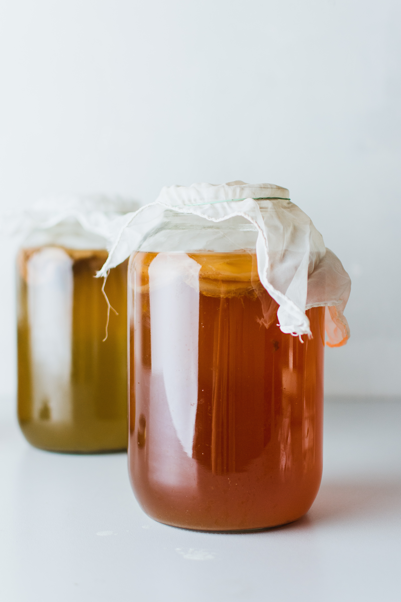
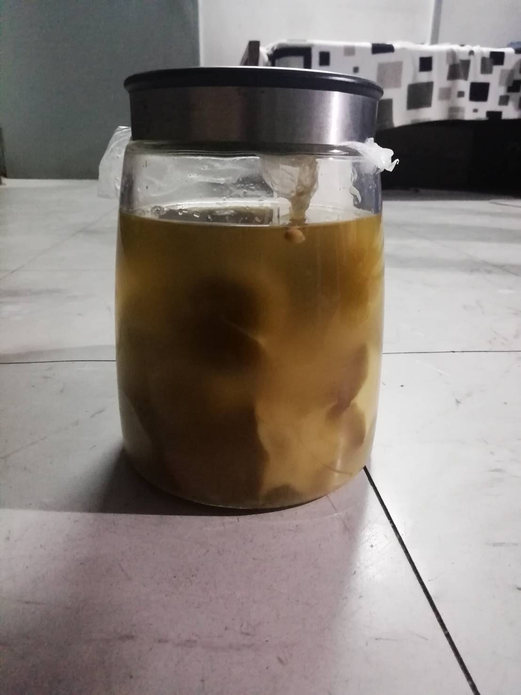

# ทดลองทำชาหมักคอมบูชา (Kombucha)
## คอมบูชาคืออะไร?
คอมบูชาคือชาที่หมักโดยการใส่หัวเชื้อและยีสต์ลงไปในชาดำ
มีสารโพลีฟีนอล(Polyphenol)ที่ช่วยระงับความเสียหายของเซลล์ที่เดิดขึ้นจากอนุมูลอิสระ
อีกทั้งยังประกอบไปด้วยกรดอะมิโน วิตามินและแร่ธาตุที่จำเป็นแก่ร่างกาย
รวมไปถึงแลคโตบาซิลลัส(Lactobacillus)และเอนไซม์ที่ช่วยเพิ่มแบคทีเรียที่ีประโยชน์ต่อลำไส้
ซึ่งส่งผลต่อกระบวนการซ่อมแซมกระบวนการทำงานของลำไส้
## ประโยชน์
- แก้ปัญหาท้องผูก
- ดูแลกระบวนการดูดซึมในทางเดินอาหร
- ช่วยในการขับของเสียออกจากร่ายกายได้ง่าย
## แน่นอนว่าสิ่งที่แรกที่ต้องทำคือScobyหรือหัวเชื้อสำหรับคอมบูชานั้นเอง

## รอมาเดือนหนึ่งแล้วรอต่อปายยย

### บทความนี้อยู่ในระหว่างการทดลองจะทำเป็นตัวเต็มในภายหลัง

  <h3>
ZIXGUS
</h3>

