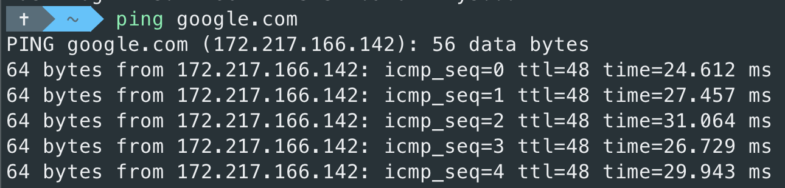

# Before I start

หลังจากเรียนเกี่ยวกับLinux osโดยใช้VM(Virtual Machine)เลยลองสรุปแบบคร่าวๆ

# Command Line

| Command | Description |
| ----------- | ----------- |
| cd          | เปลี่ยน directory |
| ls | แสดงข้อมูล directory |
| pwd | แสดง directory ที่กำลังใช้งาน|
| mkdir | สร้าง directory |
| cat | แสดงข้อมูลภายในfile |
| man| แสดงคู่มือการใช้งานของcommand |
| less |  แสดงข้อมูลภายในfileโดยแสดงเป็นหน้า |
| rm | ลบfile |
| echo | เรียกinput |

# Ping

# Vim
| Command | Description |
| ----------- | ----------- |
| insert mode       | i |
| command mode| ESC |
| last line mode | : |
https://linuxmoz.com/vi-commands-cheat-sheet/

### บทความนี้อยู่ในระหว่างการทดลองจะทำเป็นตัวเต็มในภายหลัง

  <h3>
ZIXGUS
</h3>

