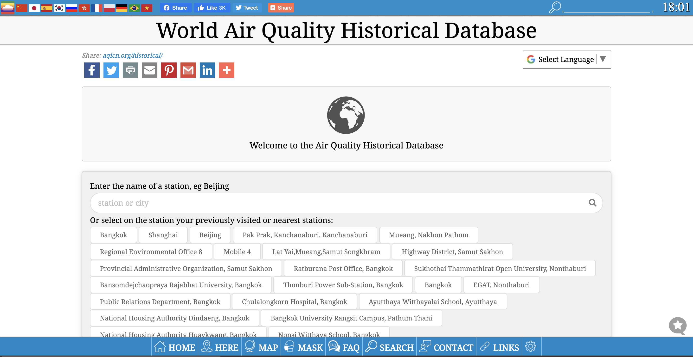
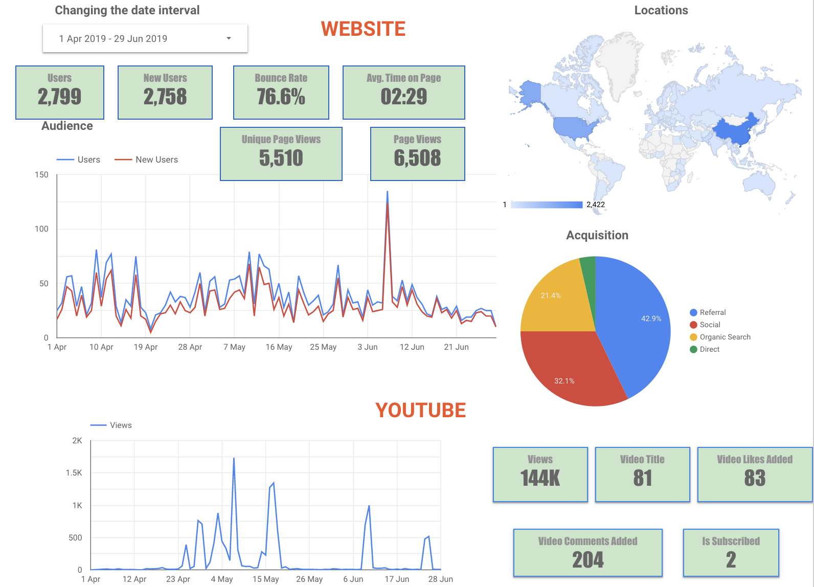

# PM2.5&COVID-19

# แรงบันดาลใจ

PM 2.5และ COVID–19เป็นปัญหาสำคัญระดับประเทศและโลกเราไม่สามารถคาดการณ์ได้ว่าในอนาคตปัญหา เหล่านี้จะเป็นเช่นไรแนวโน้มไปในทางที่ดีขึ้นหรือเลวร้ายลง การวางแผนดำเนินการแก้ไขและบรรเทาความเสียหายย่อมอาศัย ภาครัฐบาลหรือหน่วยงานใดหน่วยงานหนึ่งเพียงอย่างเดียวคงเป็นไปไม่ได้ แม้สิ่งที่เราทำอาจเป็นเพียงสิ่งๆเล็กแต่ก็คิดว่าอาจมีประโยชนน์สำหรับส่วมรวม ซึ่งปัญหาใดๆ ที่เกิด ขึ้น พวกเราเชื่อว่าคนไทยย่อมร่วมกันแก้ไขได้อย่างแน่นอนในที่สุด

# เทคนิคที่ใช้ในการดึงข้อมูล

ใช้PythonและPandas ดึงข้อมูลจากWorld Air Quality 

    import pandas as pd
    data = pd.read_csv('/content/bkk.csv')
    print(data)
    data2 = pd.read_csv('/content/bkk.csv',sep='\s+',usecols=[0,1],nrows=195)
    data2.to_csv('data3', sep='\t')

[Google Colaboratory](https://colab.research.google.com/drive/1AbjAFmwhoK0xq8EkrXxFOCw4a8qrfARD)

จากนั้นเรานำข้อมูลไปแสดงผลในgoogle Data studio

# ผลลัพธ์

<iframe width="600" height="450" src="https://datastudio.google.com/embed/reporting/5a9ca841-3e94-4652-ab5d-6b6aa3e995af/page/l8tMB" frameborder="0" style="border:0" allowfullscreen></iframe>

# ผู้จัดทำ
นาย ปณิธิ ยุวดีรักษา 07610719

นาย ศักดิ์ณรงค์​ สมบัติเจริญ 07610477

นาย ณัฐวัฒน์ ศรีคง 07610715